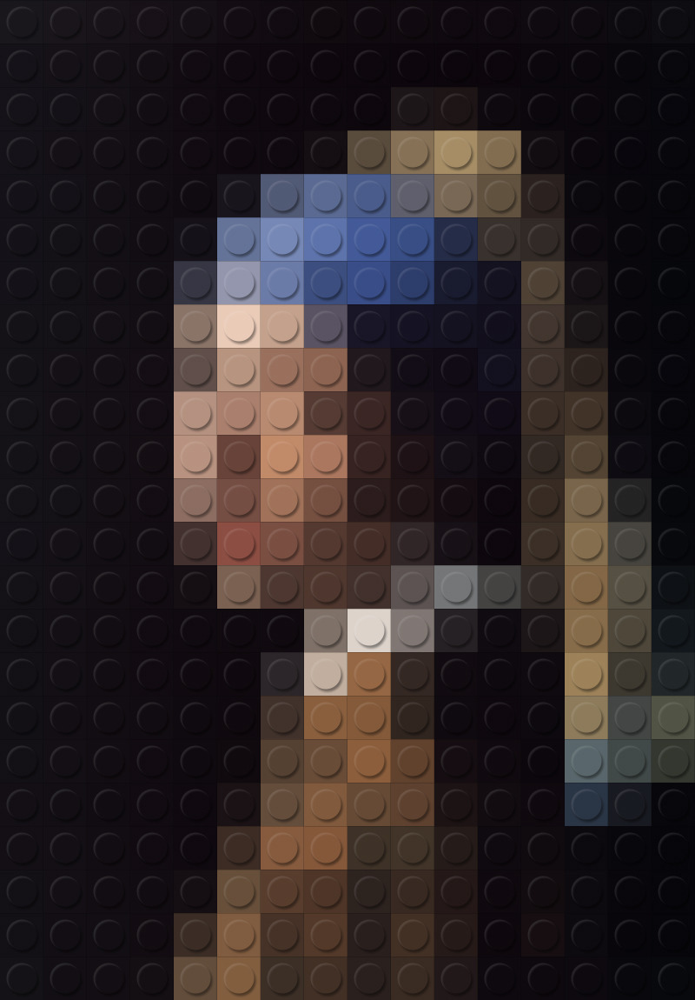
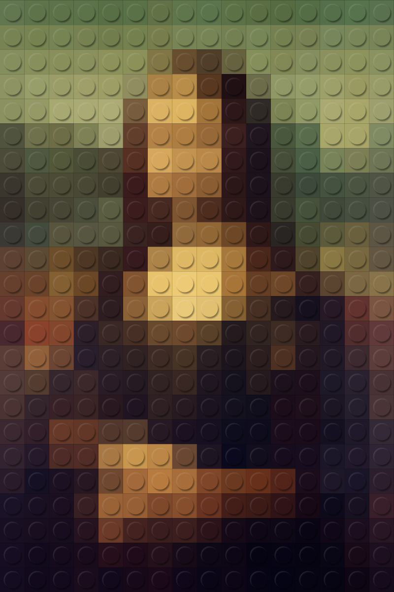
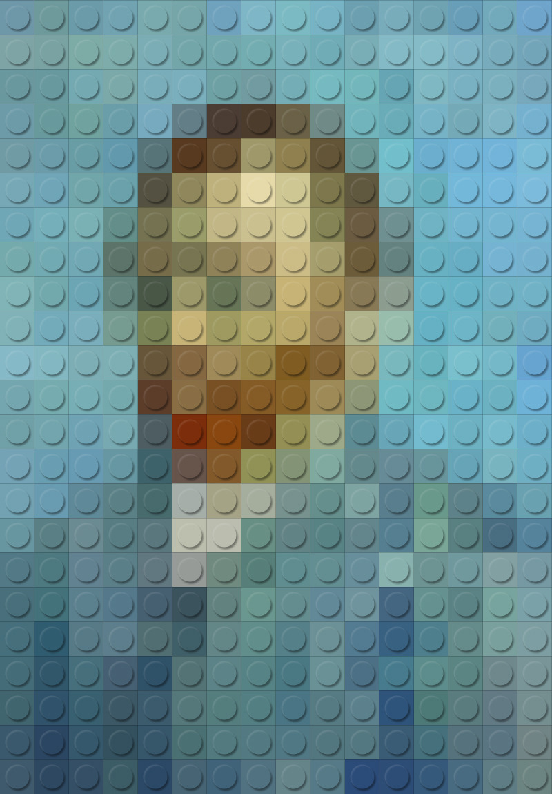

# pic2art

Transform photos into artistic styles with pure code

将照片转换为艺术风格的纯代码工具

---

## Gallery

**LEGO Mosaic Style** - Inspired by [Geoffroy Amelot](https://supergeoffroy.tumblr.com/archive/2013/10)

<table>
  <tr>
    <td align="center">
      
      <br/><em>Girl with a Pearl Earring</em>
    </td>
    <td align="center">
      
      <br/><em>Mona Lisa</em>
    </td>
    <td align="center">
      
      <br/><em>Van Gogh Self-Portrait</em>
    </td>
  </tr>
</table>

---

## About

A pure-code image stylization tool. Currently supports **LEGO Mosaic** style with realistic physical details: brick gaps, plastic reflections, color variations, and ambient occlusion.

纯代码实现的图片风格化工具。当前支持 **LEGO 马赛克**风格，模拟砖缝、塑料反光、颜色微差、环境光遮蔽等物理细节。

### Styles

- ✅ **LEGO Mosaic** - Available now
- 🔲 **Pixel Art** - Planned
- 🔲 **Cross-stitch** - Planned

## Installation

```bash
pip install -r requirements.txt
```

## Usage

```bash
# Interactive mode - select style and configure
python pic2art.py

# List available styles
python pic2art.py --list

# Direct usage with parameters
python pic2art.py --style lego --in photo.png --out result.png
```

## Parameters

### LEGO Mosaic Style

| Parameter | Default | Description |
|-----------|---------|-------------|
| `--grid-w` | 16 | Horizontal stud count |
| `--grid-h` | 24 | Vertical stud count |
| `--tile` | 64 | Pixels per stud |
| `--colors` | 22 | Palette colors after quantization |
| `--gap` | 0.6 | Brick gap strength (0~1.0) |
| `--fresnel` | 0.5 | Plastic reflection strength (0~1.0) |
| `--color-var` | 0.4 | Color variation strength (0~1.0) |
| `--ao` | 0.5 | Ambient occlusion strength (0~1.0) |

## Project Structure

```
pic2art/
├── pic2art.py          # Main entry point
├── styles/             # Style implementations
│   └── lego_mosaic.py
├── examples/           # Example images
│   └── lego/
│       ├── inspiration/  # Geoffroy Amelot's works
│       ├── input/
│       └── output/
└── requirements.txt
```

## Requirements

- Python 3.7+
- Pillow >= 9.0.0
- NumPy >= 1.21.0

## License

MIT
